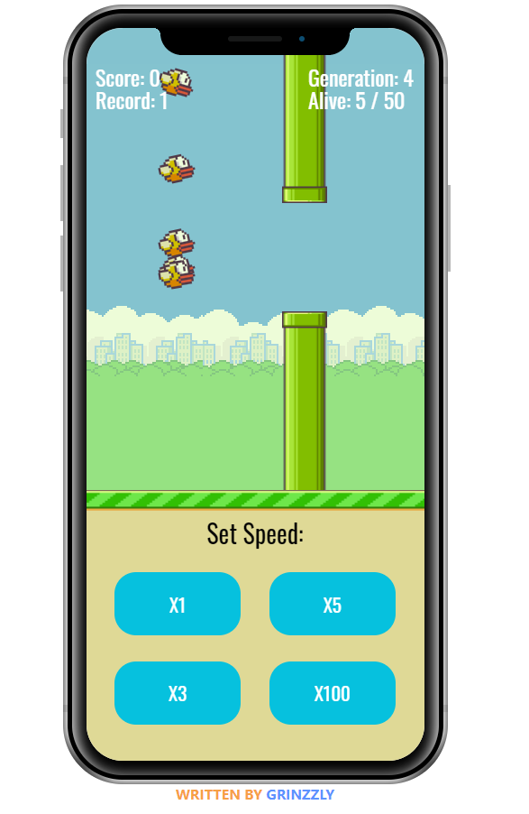

<h1 align="center">Flappy Bird with AI</h1>

  The little bird machine that flaps. Coded by
    <a href="https://github.com/Grinzzly">Grinzzly</a>
  
   
   
  
  &nbsp;
  

## About
Hack old faithful Flappy Bird with Neural Network and Genetic Algorithm.

You may observe result [here](https://flappy-bird.simplexco.de).
 

  

## Installation & Usage

From the root of the project directory:

just open `index.html` for god sake

## Technology in use

* JavaScript

